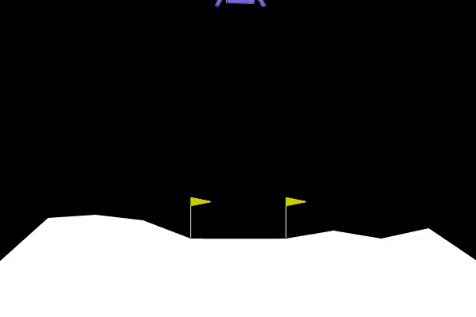
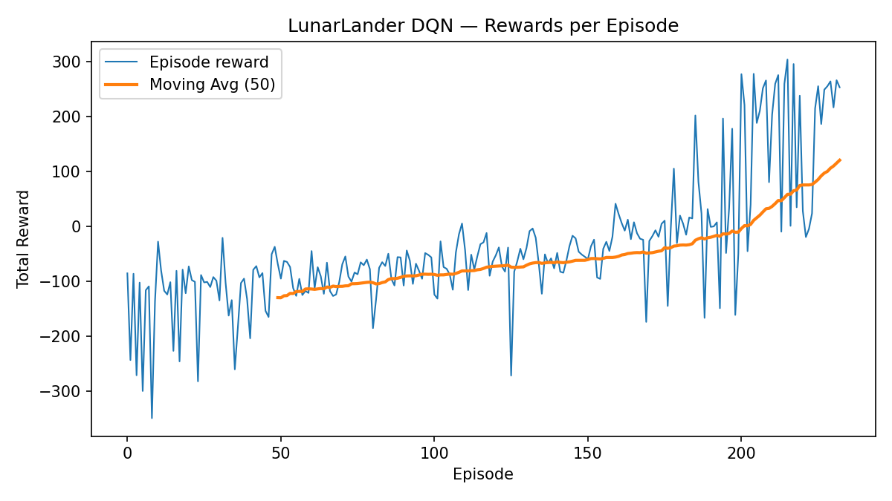

# 🛸 LunarLander with Deep Q-Network (DQN)

## 1️⃣ Project Overview
This project uses **Reinforcement Learning**, specifically the **Deep Q-Network (DQN)** algorithm, to train an agent to land a spacecraft smoothly on the moon between two flags.
The agent learns through trial and error by interacting with the environment, receiving rewards for good landings and penalties for crashes or unstable movement.

---

## 2️⃣ Random Agent Results
Before training, the environment was tested using a random agent (no learning).
The lander moved aimlessly, often spinning or crashing within seconds.
The **average reward was -360.64**, showing that the random agent performed very poorly.

📹 Random test videos

---

## 3️⃣ DQN Agent Results
After training the DQN agent for **50,000 steps**, the model learned how to control the engines effectively.
It was able to land safely near the center most of the time.
The rewards became positive (around **+100 to +250**), showing significant improvement.

📹 Trained agent videos

---

## 4️⃣ Rewards Plot

The plot shows the agent’s learning progress — the rewards increase over time, indicating successful training.

---

## 5️⃣ Observations
- The random agent failed to land properly.
- The DQN agent gradually learned stable and centered landings.
- Hyperparameters such as **learning rate** and **epsilon decay** had a clear impact on training speed.

---

## 6️⃣ Conclusion
This project demonstrates how **Deep Reinforcement Learning** enables an agent to learn complex control tasks such as lunar landing.
Using the DQN algorithm, the agent evolved from random movements to intelligent and stable flight behavior.
